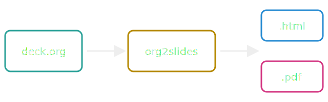

:REVEAL_PROPERTIES:
#+REVEAL_ROOT: ./revealjs/
#+REVEAL_THEME: black
#+REVEAL_INIT_OPTIONS: slideNumber:true
:END:

#+title: org2slides — Minimal Example
#+subtitle: One org file, two artifacts
#+author: Your Name
#+date: 2026
#+language: en

* Why
Write the deck once, in org. Then:

#+REVEAL_HTML: 

- ~C-c C-e R R~ (or =org2slides --html=) → reveal.js presentation
- =org2slides --pdf= → Beamer PDF, derived from the same file
- =org2slides examples/minimal.org= → both at once
#+REVEAL_HTML: 

* Layout comes from CSS, not LaTeX
#+REVEAL_HTML: 

#+REVEAL_HTML: 

The converter reads the deck's own HTML/CSS hints:

- this grid becomes Beamer columns
- the image on the right gets its rounded corners
- no ~#+ATTR_LATEX~ anywhere
#+REVEAL_HTML: 

#+ATTR_HTML: :style border-radius: 12px;
[[file:assets/photo.jpg]]
#+REVEAL_HTML: 

* Vector graphics stay vector
This SVG is embedded as-is in the HTML and converted to a vector PDF for
pdflatex — crisp at any zoom level:

* Speaker notes vanish in the PDF
This slide carries speaker notes — press =s= in the browser to see them.
The PDF drops them.

#+BEGIN_NOTES
Hello from the speaker notes. Only the reveal deck shows this.
#+END_NOTES
