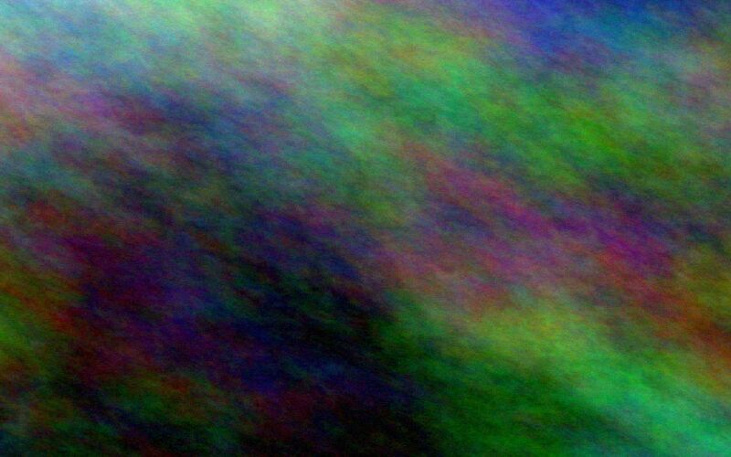
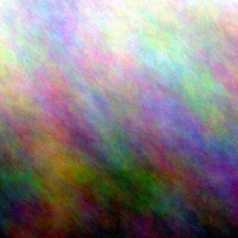

:REVEAL_PROPERTIES:
#+REVEAL_ROOT: ./revealjs/
#+REVEAL_THEME: black
#+REVEAL_INIT_OPTIONS: slideNumber:true
:END:
#+MACRO: video @@html: <video $1 width=$2 src=$3></video>@@

#+title: org2slides — Feature Showcase
#+subtitle: Everything the converter translates
#+author: Your Name
#+date: 2026
#+language: en

* Video → poster frame
{{{video(data-autoplay loop muted controls, 70%, ./assets/clip.mp4)}}}

The HTML plays the clip; the PDF shows an ffmpeg poster frame instead.

* Image row with object-fit: cover
#+REVEAL_HTML: 

#+ATTR_HTML: :style object-fit: cover; aspect-ratio: 16/9; border: 3px solid #2aa198; border-radius: 12px;

#+ATTR_HTML: :style object-fit: cover; aspect-ratio: 16/9; border: 3px solid #d33682; border-radius: 12px;

#+REVEAL_HTML: 

Cover-crop, coloured borders and radii carry into the PDF (tikz clips).

* Circular avatar + icons
#+REVEAL_HTML: 

#+ATTR_HTML: :width 55% :style border-radius: 50%;

#+REVEAL_HTML: 

#+REVEAL_HTML: <ul><li><i class="fa-solid fa-check"></i> font-awesome icons carry into the PDF</li><li><i class="fa-solid fa-rocket"></i> hand-written HTML lists become org lists</li><li><i class="fa-solid fa-circle-question"></i> unknown icons degrade silently</li></ul>
#+REVEAL_HTML: 

#+REVEAL_HTML: 

* Code stays code
#+BEGIN_SRC python :exports code
def export(deck):
    return [f"{deck}.html", f"{deck}_beamer.pdf"]
#+END_SRC

Blocks with ~:exports code|both~ render as listings in both outputs;
babel figure generators are dropped (their committed results are used).

* Dense text shrinks to fit
#+REVEAL_HTML: 

- reveal ~font-size~ wrapper divs become Beamer size groups
- so deliberately-shrunk slides do not overflow the PDF frame
- terminal box-drawing characters (╒═╕│) are transliterated for pdflatex
#+REVEAL_HTML: 

